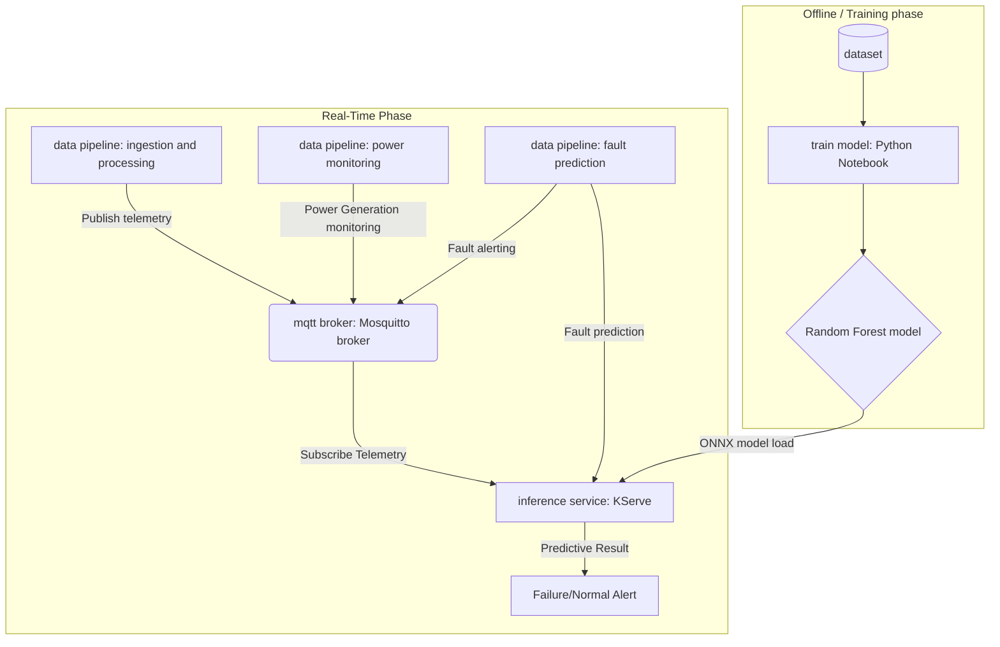

# Edge-WindGuard

**Edge-WindGuard** is a Kubernetes-native, microservice-oriented framework for the predictive maintenance of wind turbines. The system provides an end-to-end pipeline—from model training and data ingestion to real-time inference—designed to detect turbine failures using a Random Forest classifier.

## System Architecture

The architecture is built on a decoupled, event-driven model. The **Data Pipeline** acts as a producer, sending sensor telemetry to the **MQTT Broker**, which then routes that data to the **Inference Service** for real-time analysis.

1. **`mqtt_broker`**: The central communication hub (Eclipse Mosquitto). It handles the pub/sub logic, allowing the pipeline and inference services to remain decoupled.
2. **`train_model`**: The offline development environment. It consumes historical data from the `dataset/` folder to produce the trained Random Forest model.
3. **`data_pipeline`**: The data producer. It reads sensor data and publishes it to the broker. In a production environment, this would interface with actual turbine PLCs or IoT gateways.
4. **`inference_svc`**: The consumer and predictor. Deployed via **KServe**, it subscribes to the broker, runs the telemetry through the trained model, and outputs failure predictions.


---

## Project Structure

```text
edge-windguard/
├── mqtt_broker/      # Kubernetes manifests (Deployment/Service) for Mosquitto
├── train_model/      # Model development (iiot-wind-turbine-train-test-persist.ipynb)
├── data_pipeline/    # Data ingestion service (Requirements inside)
├── inference_svc/    # KServe InferenceService configuration and predictor logic
└── dataset/          # Active datasets used for training and streaming

```

*(Note: `dataset_old`, Isolation Forest files, and `apps-description` are deprecated.)*

---

## Model Training & Persistence

The core intelligence of the system is developed in the **`iiot-wind-turbine-train-test-persist.ipynb`** notebook. This notebook follows a structured pipeline:

* **Data Loading & Exploration:** Imports raw Industrial IoT (IIOT) sensor data (Wind Speed, Power, Ambient Temperature, etc.).
* **Preprocessing:** Cleans sensor noise and prepares features that characterize normal vs. failing turbine states.
* **Random Forest Implementation:** Utilizes a **Random Forest Classifier** to handle the non-linear patterns of sensor data.
* **Evaluation:** Generates **Confusion Matrices** and **Classification Reports** to ensure the model accurately flags failures.
* **Model Persistence:** Uses `joblib` or `pickle` to serialize the final model for the **KServe** predictor.

---

## Setup & Execution (Kubernetes & KServe)

### 1. Requirements

Each service is self-contained. Check `data_pipeline/` and `inference_svc/` for their respective `requirements.txt` or `Containerfile`.

### 2. Deploy the MQTT Broker

```bash
kubectl apply -f mqtt_broker/

```

### 3. Deploy the Inference Service (KServe)

```bash
kubectl apply -f inference_svc/isvc.yaml

```

### 4. Deploy the Data Pipeline

```bash
kubectl apply -f data_pipeline/deployment.yaml

```

---


## License

This project is licensed under the MIT License.
