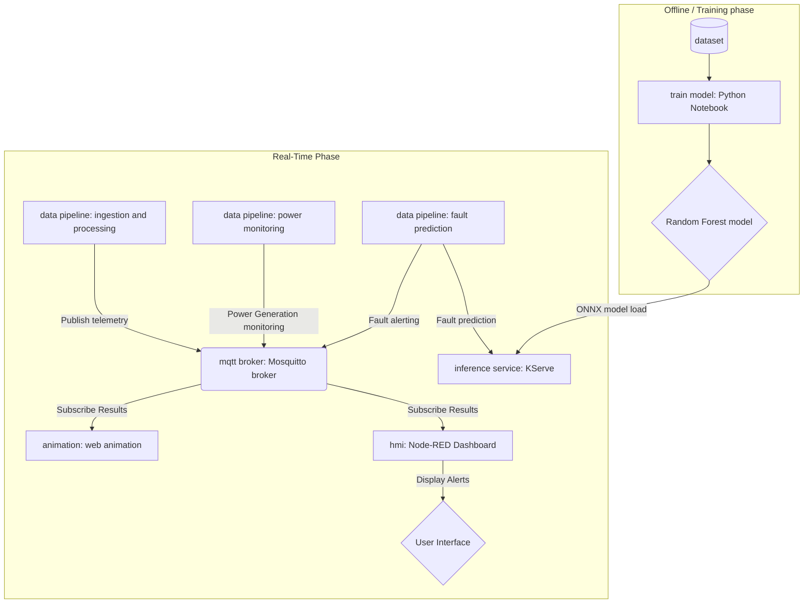

# Edge-WindGuard

**Edge-WindGuard** is a Kubernetes-native, microservice-oriented framework for the predictive maintenance of wind turbines. The system provides an end-to-end pipeline—from model training and data ingestion to real-time inference and visualization—designed to detect turbine failures using a Random Forest classifier.

## System Architecture

The architecture is built on a decoupled, event-driven model. The **Data Pipeline** acts as a producer, sending sensor telemetry to the **MQTT Broker**, which then routes that data to the **Inference Service** for real-time analysis.

1. **`mqtt_broker`**: The central communication hub (Eclipse Mosquitto). It handles the pub/sub logic, allowing the pipeline and inference services to remain decoupled.
2. **`train_model`**: The offline development environment. It consumes historical data from the `dataset/` folder to produce the trained Random Forest model.
3. **`data_pipeline`**: The data producer. It reads sensor data and publishes it to the broker. In a production environment, this would interface with actual turbine PLCs or IoT gateways.
4. **`inference_svc`**: The consumer and predictor. Deployed via **KServe**, it subscribes to the broker, runs the telemetry through the trained model, and outputs failure predictions.
5. hmi: The visualization layer. A Node-RED dashboard that provides a real-time interface for operators.


---

## Project Structure

```text
edge-windguard/
├── mqtt_broker/      # Kubernetes manifests (Deployment/Service) for Mosquitto
├── train_model/      # Model development (iiot-wind-turbine-train-test-persist.ipynb)
├── data_pipeline/    # Data ingestion service (Requirements inside)
├── inference_svc/    # KServe InferenceService configuration and predictor logic
├── hmi/              # Node-RED dashboard & K8s deployment files
└── dataset/          # Active datasets used for training and streaming

```

*(Note: `dataset_old`, Isolation Forest files, and `apps-description` are deprecated.)*

---
## Dependency Management with uv

The inference_svc utilizes `uv`, an extremely fast Python package installer and resolver, to manage its environment.

To update or regenerate the requirements.txt for this specific service:

```Bash
cd inference_svc
# Generate a pinned requirements file
uv python pin 3.12.12
uv init --package
uv sync
uv pip compile pyproject.toml -o requirements.txt
```

This ensures that the KServe container environment is reproducible and installs significantly faster during the CI/CD build process.

---
## Dataset Information

The model training and simulation are based on the IIoT Data of Wind Turbine dataset, as explored in the [IIoT Wind Turbine Analytics Kaggle](https://www.kaggle.com/code/yohanesnuwara/iiot-wind-turbine-analytics/notebook) notebook by Yohanes Nuwara.

The dataset contains real-world industrial IoT telemetry including:  

- *scada_data.csv*: Over 60 high-dimensional features recorded by SCADA systems (Wind Speed, Power, Temperature, etc.).
- *fault_data.csv*: Labeled fault types and timestamps for supervised learning.
- *status_data.csv*: Descriptions of operational states.

This data originates from the Microsoft Azure Predictive Maintenance Template, providing a robust foundation for identifying failure patterns in critical energy infrastructure.

---
## Model Training & Persistence

The core intelligence of the system is developed in the **`iiot-wind-turbine-train-test-persist.ipynb`** notebook. This notebook follows a structured pipeline:

* **Data Loading & Exploration:** Imports raw Industrial IoT (IIOT) sensor data (Wind Speed, Power, Ambient Temperature, etc.).
* **Preprocessing:** Cleans sensor noise and prepares features that characterize normal vs. failing turbine states.
* **Random Forest Implementation:** Utilizes a **Random Forest Classifier** to handle the non-linear patterns of sensor data.
* **Evaluation:** Generates **Confusion Matrices** and **Classification Reports** to ensure the model accurately flags failures.
* **Model Persistence:** Uses `joblib` or `pickle` to serialize the final model for the **KServe** predictor.

---
## HMI & Dashboard

The HMI (Human-Machine Interface) is built with Node-RED and provides a graphical dashboard to monitor turbine performance and predictive alerts.  

* Real-time Visualization: Displays live streams of wind speed, power output, and ambient temperature.  
* Predictive Alerts: Visual indicators (gauges/leds) that change state based on the failure predictions received from the inference_svc via MQTT.
---
## Setup & Execution (Kubernetes & KServe)

### 1. Requirements

Each service is self-contained. Check `data_pipeline/` and `inference_svc/` for their respective `requirements.txt` or `Containerfile`.

### 2. Deploy the MQTT Broker

```bash
kubectl apply -f mqtt_broker/

```

### 3. Deploy the Inference Service (KServe)

```bash
kubectl apply -f inference_svc/isvc.yaml

```

### 4. Deploy the Data Pipeline

```bash
kubectl apply -f data_pipeline/deployment.yaml
```
### 5. Deploy the Dashboard

```bash
# Deploy the Node-RED interface
kubectl apply -f hmi/
```

> NOTE on KServe
> When you deploy the InferenceService, KServe automatically creates the underlying Kubernetes Service and routing infrastructure (VirtualServices if using Istio).  
> You do not need to manually define a Service object for the predictor; the data pipeline can reach the inference endpoint via the URL provided by KServe after the service reaches a "Ready" state:  
>```Bash
>kubectl -n windguard get inferenceservices onnx-model
>```
---
## Tech Stack

| Category | Technology |
| --- | --- |
| **Orchestration** | Kubernetes |
| **ML Serving** | KServe |
| **Visualization** | Node-RED (Dashboard 2.0) |
| **Messaging** | MQTT (Mosquitto) |
| **Package Management** | `uv` |
| **ML Framework** | Scikit-learn (Random Forest) |

---


## License

This project is licensed under the MIT License.
